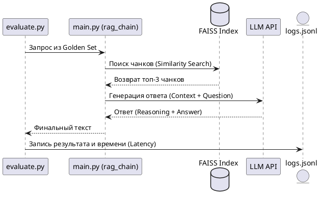

```puml
@startuml
participant "evaluate.py" as eval
participant "main.py (rag_chain)" as rag
database "FAISS Index" as faiss
participant "LLM API" as llm
entity "logs.jsonl" as logs

eval -> rag : Запрос из Golden Set
rag -> faiss : Поиск чанков (Similarity Search)
faiss --> rag : Возврат топ-3 чанков
rag -> llm : Генерация ответа (Context + Question)
llm --> rag : Ответ (Reasoning + Answer)
rag --> eval : Финальный текст
eval -> logs : Запись результата и времени (Latency)
@enduml
```